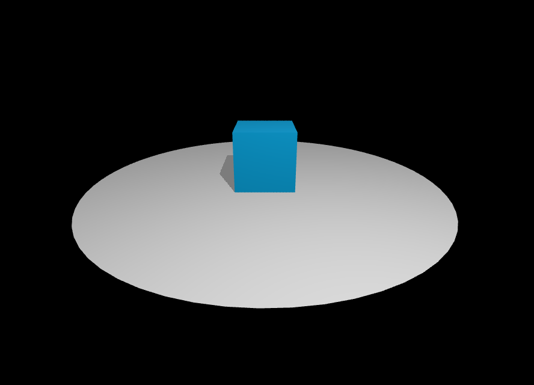

# Boxlte 
 A **minimalist** and **declarative** [library](https://www.npmjs.com/package/boxlte)  encapsulating [Svelte](https://svelte.dev/) and [Three js](https://threejs.org/). 🔥  

Made using [Svelte Kit](https://kit.svelte.dev), it aims to provide an **authentic**, **developer friendly** experience similar to that of Svelte. ✨

# Installation
To install simply install the [library](https://www.npmjs.com/package/boxlte) into an existing svelte project using ` npm install boxlte ` 

# Quick Start
Import the necessary components from either `'boxlte'` or `'boxlte/shapes'`
```js
<script>[README.md](README.md)
    import { World } from 'boxlte' 
    import { Box } from 'boxlte/shapes'
<script/>

<World>
	<Box/>
<World/>
```
Howerver, the box will not be visible as the camera is positioned at the center i.e. the same positon as the box, to see the box the `cameraPosition` need to be changed.
```js
<World cameraPosition={{ z : 5 }} >
    <Box/>
</World>
```
Objects inside the world can be manipulated by various attributes such as `position` , `rotation` which work similar to normal svelte props, these values are essentialy objects most commonly having the same syntax throughout.
# Overview
An example of a simple scene :


```js
<script>
    import { World, Light } from 'boxlte'
    import { Plane, Box } from 'boxlte/shapes'
</script>

<World cameraPosition={{y: 2, z: 5}} centerFocus>
    <Light position={{x: 1, y: 5, z: 4}} intensity={Math.PI * 13} spot/>

    <Box color="deepskyblue" position={{y: 0.5}}/>
    <Plane color="white" radius={3} rounded alignHorizontal noShadowCast />
</World>
```
Overview of the code:
* The `bind` propertiy bind the three values of a attribute to a same property `all`.


* The ` <Light/>` component has `directional`, `spot` and `point` lights all baked into one which can be chosen by adding the property.


* The `color` property simply changes the color of the Standerd Material applied to the Mesh.


* Plane components have properties such as `alignHorizontal`, `alignVertical`, and `alignSideways` which makes it easy to rotate the plane as desired.


* Plane exhibit undisireable behaviour when casting shadows (such as casting shadows onto itself) so it is recommanded to use no shadow casting on a plane. This can be achieved using the `noShadowCast` property avialable to all components.


# Drawbacks
* Limited Support in terms of feature coverage 🛠 
* Slightly Inefficeint and opionated at times 👒


